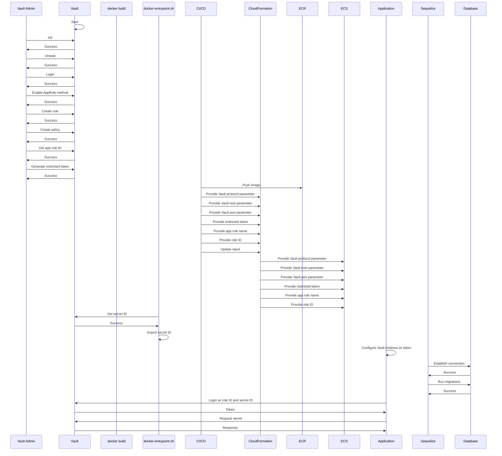

```mermaid
sequenceDiagram

    participant vaultAdmin as Vault Admin
    participant vault as Vault
    participant dockerBuild as docker build
    participant dockerEntrypoint as docker-entrypoint.sh
    # participant dockerRun as docker run
    participant cicd as CI/CD
    participant cfn as CloudFormation
    participant ecr as ECR
    participant ecs as ECS
    participant app as Application
    participant sequelize as Sequelize
    participant db as Database

    # Vault initialization & setup
    vault ->> vault: Start
    vaultAdmin ->> vault: Init
    vault ->> vaultAdmin: Success
    vaultAdmin ->> vault: Unseal
    vault ->> vaultAdmin: Success
    vaultAdmin ->> vault: Login
    vault ->> vaultAdmin: Success
    vaultAdmin ->> vault: Enable AppRole method
    vault ->> vaultAdmin: Success
    vaultAdmin ->> vault: Create role
    vault ->> vaultAdmin: Success
    vaultAdmin ->> vault: Create policy
    vault ->> vaultAdmin: Success
    vaultAdmin ->> vault: Get app role ID
    vault ->> vaultAdmin: Success
    vaultAdmin ->> vault: Generate restricted token
    vault ->> vaultAdmin: Success

    # CI: build image
    # cicd ->> dockerBuild: Provide role ID
    # cicd ->> dockerBuild: Provide secret ID
    # cicd ->> dockerBuild: Provide restricted token

    # CI: push image
    cicd ->> ecr: Push image

    # CI: update CloudFormation stack
    cicd ->> cfn: Provide Vault protocol parameter
    cicd ->> cfn: Provide Vault host parameter
    cicd ->> cfn: Provide Vault port parameter
    cicd ->> cfn: Provide restricted token
    cicd ->> cfn: Provide app role name
    cicd ->> cfn: Provide role ID
    cicd ->> cfn: Update stack

    # CloudFormation: update ECS task definition
    cfn ->> ecs: Provide Vault protocol parameter
    cfn ->> ecs: Provide Vault host parameter
    cfn ->> ecs: Provide Vault port parameter
    cfn ->> ecs: Provide restricted token
    cfn ->> ecs: Provide app role name
    cfn ->> ecs: Provide role ID

    # ECS: start container (task definition)
    dockerEntrypoint ->> vault: Get secret ID
    vault ->> dockerEntrypoint: Success
    dockerEntrypoint ->> dockerEntrypoint: Export secret ID
    app ->> app: Configure Vault instance w/ token
    sequelize ->> db: Establish connection
    db ->> sequelize: Success
    sequelize ->> db: Run migrations
    db ->> sequelize: Success
    app ->> vault: Login w/ role ID and secret ID
    vault ->> app: Token
    app ->> vault: Request secret
    vault ->> app: Response

```
