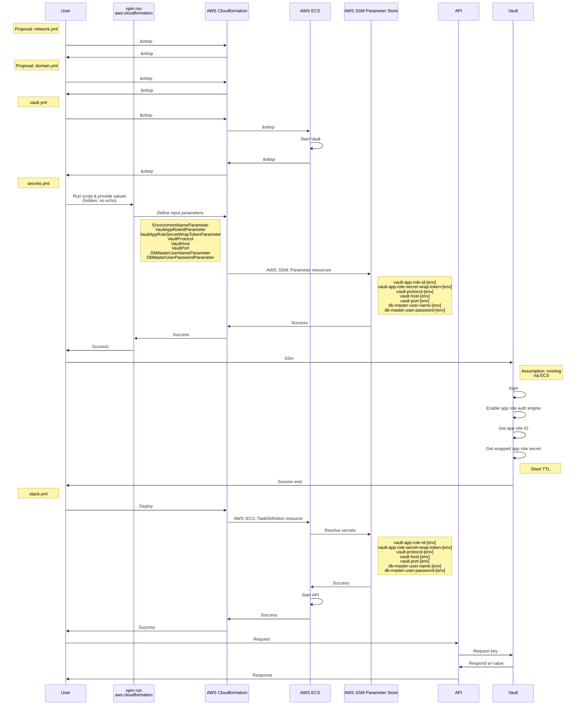

```mermaid
sequenceDiagram

    participant user as User
    participant npm as npm run<br>aws:cloudformation
    participant cfn as AWS Cloudformation
    participant ecs as AWS ECS
    participant ssm as AWS SSM Parameter Store
    participant api as API
    participant vault as Vault

    note left of user: Proposal: network.yml
    user ->> cfn: &nbsp;
    cfn ->> user: &nbsp;

    note left of user: Proposal: domain.yml
    user ->> cfn: &nbsp;
    cfn ->> user: &nbsp;

    note left of user: vault.yml
    user ->> cfn: &nbsp;
    cfn ->> ecs: &nbsp;
    ecs ->> ecs: Start Vault
    ecs ->> cfn: &nbsp;
    cfn ->> user: &nbsp;

    note left of user: secrets.yml
    user ->> npm: Run script & provide values<br>(hidden, no echo)
    npm ->> cfn: Define input parameters
    note left of cfn: EnvironmentNameParameter<br>VaultAppRoleIdParameter<br>VaultAppRoleSecretWrapTokenParameter<br>VaultProtocol<br>VaultHost<br>VaultPort<br>DbMasterUserNameParameter<br>DbMasterUserPasswordParameter
    cfn ->> ssm: AWS::SSM::Parameter resources
    note right of ssm: vault-app-role-id-[env]<br>vault-app-role-secret-wrap-token-[env]<br>vault-protocol-[env]<br>vault-host-[env]<br>vault-port-[env]<br>db-master-user-name-[env]<br>db-master-user-password-[env]
    ssm ->> cfn: Success
    cfn ->> npm: Success
    npm ->> user: Success

    user ->> vault: SSH
    # activate vault
    note right of vault: Assumption: running<br>via ECS
    vault ->> vault: login
    vault ->> vault: Enable app role auth engine
    vault ->> vault: Get app role ID
    vault ->> vault: Get wrapped app role secret
    note right of vault: Short TTL
    vault ->> user: Session end
    # deactivate vault

    note left of user: stack.yml
    user ->> cfn: Deploy
    cfn ->> ecs: AWS::ECS::TaskDefinition resource
    ecs ->> ssm: Resolve secrets
    note right of ssm: vault-app-role-id-[env]<br>vault-app-role-secret-wrap-token-[env]<br>vault-protocol-[env]<br>vault-host-[env]<br>vault-port-[env]<br>db-master-user-name-[env]<br>db-master-user-password-[env]
    ssm ->> ecs: Success
    ecs ->> ecs: Start API
    ecs ->> cfn: Success
    cfn ->> user: Success

    user ->> api: Request
    api ->> vault: Request key
    vault ->> api: Respond w/ value
    api ->> user: Response
```

---

---

